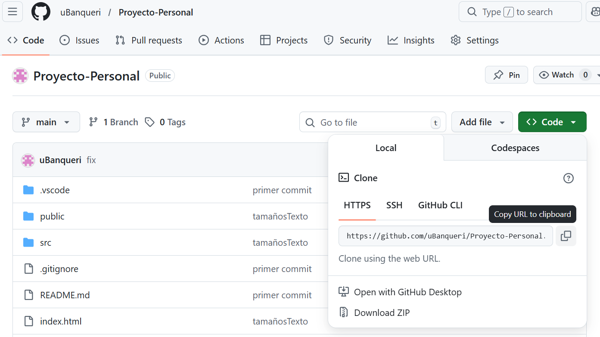
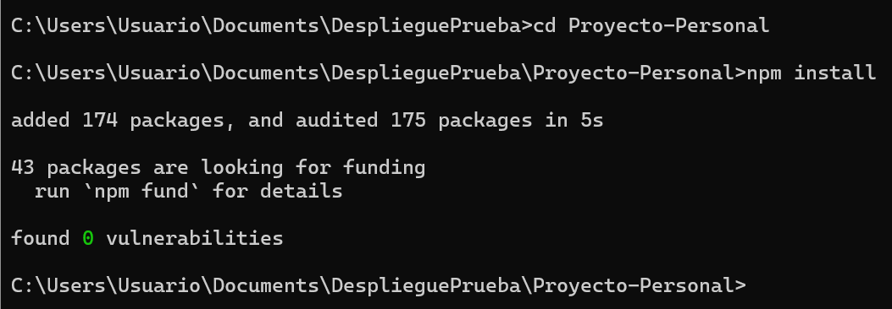
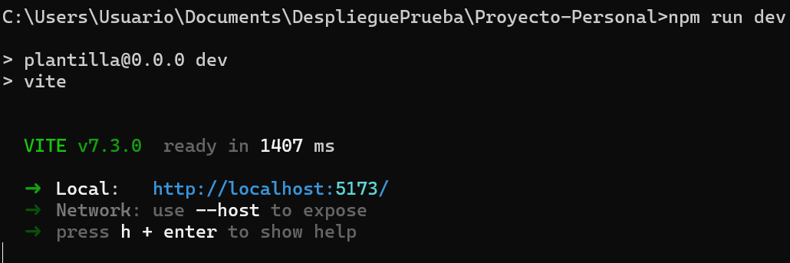
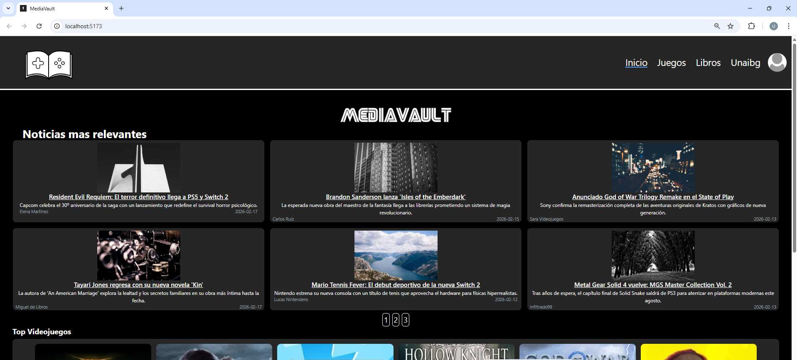

# Documentación Despliegue

1-Tener la URL del
proyecto e instalar Git y node.js en el equipo

-Link a Git: [https://git-scm.com/](https://git-scm.com/)

-Link a Node: [https://nodejs.org/es](https://nodejs.org/es)

-Link a Proyecto en Github: [https://github.com/uBanqueri/Proyecto-Personal](https://github.com/uBanqueri/Proyecto-Personal)

**- La URL del proyecto esta mas abajo no hace falta ir a GitHub -****

2-  Desde el buscador del equipo abrir la terminal del sistema “CMD”

Copiar la URL del proyecto y pegarlo en la terminal para ejecutar el comando:

“git clone https://github.com/uBanqueri/Proyecto-Personal.git ”

3-Después tendremos que entrar a la nueva carpeta que nos hemos descargado e instalar las
dependencias necesarias para desplegar la pagina en local.

En la misma terminal de comandos “CMD” del paso anterior ejecutaremos los siguientes comandos:

- cd Proyecto-Personal
- npm install

- npm run dev

Pondremos lo que nos da en el apartado de Local: [http://localhost:5173/](http://localhost:5173/) en la URL del navegador

